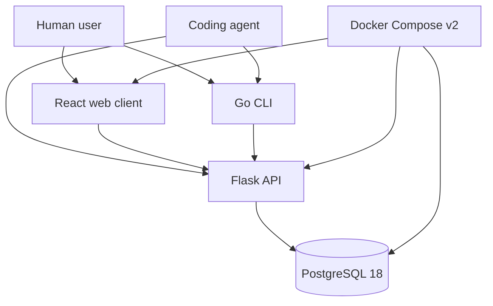

# Project Architecture

Use this file when architecture notes are useful. For very small projects, state that architecture is intentionally simple and link to the main source entry points.

## Overview

`Project Status` is a three-part monorepo:

- `api/`: Python 3.14 Flask service that owns business rules, validation, migrations, and all PostgreSQL access.
- `web/`: React application that calls the API over HTTP.
- `cli/`: Go command-line client built with Cobra and Viper that calls the API over HTTP.
- `docker-compose.yml`: local development orchestration for PostgreSQL 18 and optional API/web service containers.

The API is the only component allowed to read or write the database. Web and CLI clients share the API contract so behavior stays consistent across browser, terminal, and agent workflows.

## System Diagram

Add a Mermaid diagram or reference an image in `docs/diagrams/` when useful.

## Components

- API service:
  - Flask application factory and versioned API blueprint.
  - Request validation and response serialization.
  - Status record service layer for CRUD behavior and business rules.
  - Repository/data-access layer backed by SQLAlchemy and PostgreSQL.
  - Alembic migrations for schema changes.
  - Environment-specific configuration that reads `DATABASE_URL` for local, stage, and production.
  - Health/readiness endpoints.
- Database:
  - PostgreSQL 18 stores `status_record` rows and related indexes.
  - Local development uses the official PostgreSQL 18 container through Docker Compose v2.
  - Stage and production may use dedicated PostgreSQL VMs; the API should treat those as external database endpoints configured by `DATABASE_URL`.
  - Schema should start simple and migrate forward as requirements become more precise.
- Web client:
  - React single-page application.
  - API client module for status record endpoints.
  - Views for list, detail, create/edit form, delete confirmation, loading, empty, and error states.
- CLI client:
  - Cobra command tree for `add`, `list`, `show`, `update`, `delete`, and `config`.
  - Viper-backed configuration for API base URL, output format, and defaults.
  - Shared HTTP client package for API requests and typed responses.
- Local orchestration:
  - Docker Compose v2 should define at least a `db` service using PostgreSQL 18.
  - Compose should support developer workflows for API and web services, with bind mounts or rebuild commands chosen during scaffolding.
  - Compose environment files should be examples only; real local, stage, and production secrets must stay uncommitted.

## Data Flow

1. A user or agent performs an action in the web client, CLI, or directly against the API.
2. The client sends a JSON HTTP request to the Flask API.
3. The API validates input, applies status-record business rules, and performs a transactional database operation.
4. The API connects to the database endpoint specified by `DATABASE_URL`: local Compose PostgreSQL 18 during development, or a stage/production PostgreSQL VM when deployed.
5. PostgreSQL returns persisted data to the API.
6. The API serializes a JSON response with stable status codes and error shapes.
7. The web or CLI client renders the result for humans or agents.

## Decisions

Record architecture decisions here or summarize them in `MEMORY.md`.

- Use an API-first architecture. The Flask API is the system of record and the only database writer.
- Use a monorepo with `api/`, `web/`, and `cli/` top-level directories.
- Keep authentication out of MVP per project scope, but keep request validation and secret handling strict.
- Prefer explicit REST endpoints under `/api/project/status` so web, CLI, and future agents can share one stable contract.
- Prefer migrations from the first database commit to avoid ad hoc local schemas.
- Use Docker and Docker Compose v2 as the default local development entry point.
- Keep database connectivity environment-driven so stage and production can point at dedicated PostgreSQL VMs without code changes.
