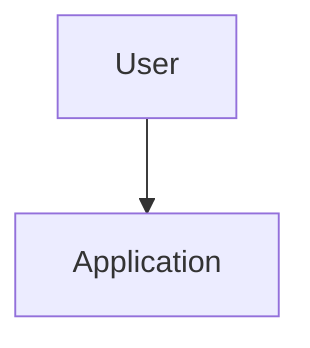

# Project Architecture

Use this file when architecture notes are useful. For very small projects, state that architecture is intentionally simple and link to the main source entry points.

## Overview

-

## System Diagram

Add a Mermaid diagram or reference an image in `docs/diagrams/` when useful.

## Components

-

## Data Flow

-

## Decisions

Record architecture decisions here or summarize them in `MEMORY.md`.
