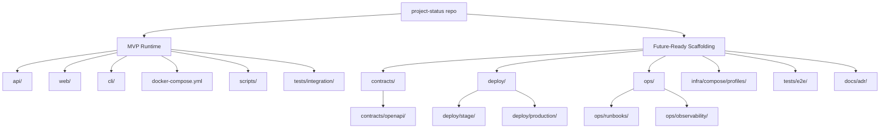

# Repository Structure

This document captures the intentional project layout for MVP and beyond.

## MVP-Critical Paths

- `api/` Flask API + DB access + migrations/tests
- `web/` React client consuming API
- `cli/` Go CLI consuming API
- `docker-compose.yml` Compose-first local orchestration
- `scripts/` smoke and helper scripts
- `tests/integration/` containerized API integration checks

## Future-Ready Scaffolding

- `contracts/` API/public contract artifacts (`openapi/` placeholder)
- `deploy/` stage/production deployment scaffolding
- `ops/` runbooks and observability placeholders
- `infra/compose/profiles/` compose profile layering placeholders
- `tests/e2e/` reserved for post-MVP e2e coverage
- `docs/adr/` architecture decision records

## Visual Layout

